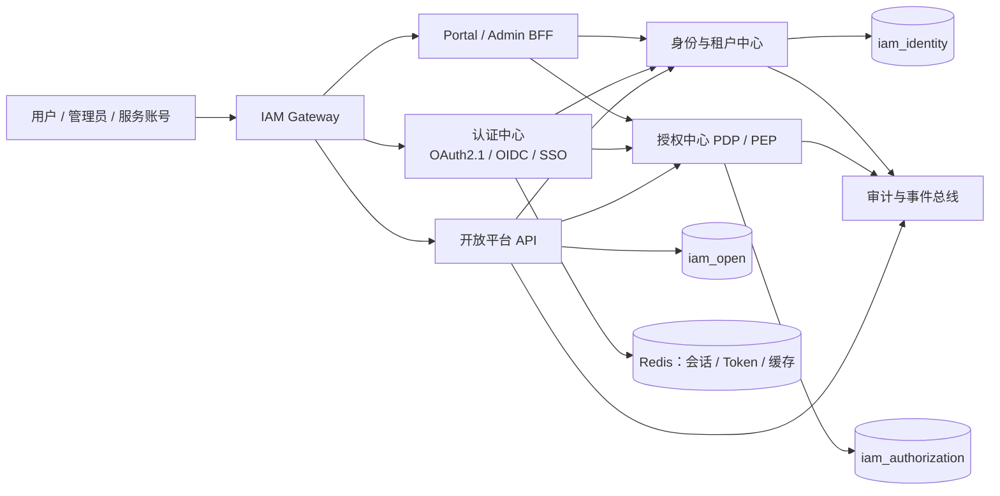

# newiam 企业级统一认证平台架构规划

> 文档版本：V1.0  
> 规划日期：2026-09-01  
> 适用范围：`newiam`，用于替代并承接 `iam-platform` 的能力建设

## 1. 规划结论

`newiam` 已经具备统一认证平台的最小骨架：

- `iam-auth-server`：OAuth 2.1 / OIDC、登录、授权码、设备码、Token、SSO 会话
- `iam-identity-service`：用户、租户、客户端、会话、认证记录管理 API
- `iam-access-service`：RBAC、应用目录、应用授权、接口准入、PDP `decide`
- `iam-open-service`：开放能力目录、订阅与准入
- `iam-gateway`：外部统一入口
- Portal/Admin BFF 与演示客户端：验证 SSO、PKCE、Device Code 和开放能力链路

当前不建议继续直接堆叠业务功能，而应先完成以下三件事：

1. 把“用户、租户、组织、身份源、应用、客户端、权限、审计”定义成稳定领域模型。
2. 把认证、管理、授权、开放平台之间的调用边界和数据所有权固化。
3. 以可验证的企业场景为主线交付，而不是以“接口数量”作为进度指标。

## 2. 目标能力地图



### 2.1 业务域

| 领域 | 核心能力 | 目标状态 |
|---|---|---|
| 认证中心 | 登录、登出、SSO、OIDC、OAuth2、MFA、密码策略、Token 撤销 | `iam-auth-server` 负责运行时闭环 |
| 身份中心 | 用户、账号、身份绑定、服务账号、生命周期、会话 | `iam-identity-service` 负责管理面 |
| 租户中心 | 租户、租户成员、租户管理员、租户级配置、租户隔离 | 身份中心拥有租户主数据 |
| 组织中心 | 集团/公司/部门/岗位、人员归属、组织树 | 建议由身份中心拥有组织主数据 |
| 授权中心 | RBAC、组织授权、用户授权、应用授权、接口准入、策略决策 | `iam-access-service` 负责 PDP |
| 应用中心 | 应用、渠道、OAuth Client、回调地址、Scope、应用可见性 | 应用元数据与 OAuth Client 解耦 |
| 开放平台 | 能力目录、订阅、凭证、配额、调用统计、Webhook | `iam-open-service` 逐步产品化 |
| 治理中心 | 审计、风控、告警、数据导出、合规留痕 | 独立横切能力，不能只依赖业务日志 |

## 3. 架构原则

### 3.1 领域与数据所有权

| 数据 | 唯一写入者 | 其他服务访问方式 |
|---|---|---|
| 用户凭据、账号状态、租户目录 | `iam-auth-server` / 身份中心协同 | 内部 API、事件 |
| OAuth Client、授权记录、会话 | `iam-auth-server` | 管理 API、事件 |
| 组织、成员归属、身份绑定 | `iam-identity-service` | 管理 API、目录查询 |
| 角色、权限、应用授权、PDP 策略 | `iam-access-service` | PDP `decide`、管理 API |
| 开放能力、订阅、配额 | `iam-open-service` | 开放 API、管理 API |
| 审计事件 | 审计中心/事件消费者 | 追加写，不允许业务服务直接修改历史记录 |

跨库继续使用业务编码引用，不建立跨库外键，不做跨库 Join。建议统一使用：

- `tenant_code`：租户编码
- `user_code`：用户业务编码，Token 的 `sub`
- `org_code`：组织编码
- `role_code`：角色编码
- `app_code`：应用编码
- `client_id`：OAuth Client 编码
- `capability_code`：开放能力编码

### 3.2 认证与授权分离

- 认证中心回答“你是谁、凭据是否有效、Token 是否有效”。
- 授权中心回答“你能否访问某个应用、接口或数据”。
- 管理服务不能绕过认证中心直接写凭据。
- 业务服务不应自行解析角色规则，统一调用 PDP 或使用标准 PEP。
- 默认拒绝：未注册客户端、未匹配策略、租户不一致、订阅失效时均拒绝。

### 3.3 多租户模型

第一阶段采用“共享数据库、共享表、强制 `tenant_code` 条件”的逻辑隔离模型：

- 所有租户业务表必须有 `tenant_code`，系统级数据明确标记为平台域。
- 管理员操作必须带租户上下文，平台管理员与租户管理员分级。
- `tenant_code` 不从普通请求参数直接信任，优先从登录上下文、签发声明或受控 Header 解析。
- 任何查询、缓存 Key、审计事件、配额统计都必须带租户维度。
- 为未来大租户独立库预留 `tenant_id`、数据路由和迁移接口，但不在当前阶段引入复杂分库。

### 3.4 Token 与缓存策略

建议路线：

1. 近期继续使用 Opaque Token，保留即时撤销能力。
2. 完成 Token Key 命名、TTL、撤销、主动下线、缓存击穿保护和审计。
3. 中期评估 JWT 只读访问场景；管理面和高风险场景仍支持即时撤销。
4. 所有生产密钥、客户端密钥、数据库密码移出仓库，使用环境变量或密钥管理系统。

## 4. 推荐目标工程形态

当前服务拆分可以保留，但边界需要调整：

```text
newiam/
├─ server/
│  ├─ iam-common/              # 仅放基础设施、错误码、上下文、契约，不放领域逻辑
│  ├─ iam-gateway/             # 外部入口、路由、限流、Trace、统一错误响应
│  ├─ iam-auth-server/         # OAuth/OIDC 运行时与凭据认证
│  ├─ iam-identity-service/    # 用户、租户、组织、身份源、生命周期管理
│  ├─ iam-access-service/      # RBAC、应用授权、PDP、策略缓存
│  └─ iam-open-service/        # 能力目录、订阅、凭证、配额、调用治理
├─ bff/
│  ├─ iam-admin-service/       # 管理台聚合与权限校验
│  └─ iam-portal-service/      # 用户门户、应用目录、SSO
├─ web/
│  ├─ iam-admin-web/
│  └─ iam-portal-web/
├─ clients/                    # 协议和接入示例
├─ sql/
│  ├─ iam_identity_v2/
│  ├─ iam_authorization_v2/
│  └─ iam_open/
└─ docs/
```

服务间调用分三类：

1. **同步查询**：认证期间的用户、策略、PDP `decide`。
2. **管理命令**：通过内部受保护 API，由管理 BFF 或身份编排服务发起。
3. **领域事件**：用户禁用、租户停用、角色变更、客户端撤销、订阅变更、审计事件。

## 5. 关键领域模型补齐

当前 SQL 已覆盖用户、租户、OAuth Client、RBAC、应用、组织、应用授权、能力和订阅。企业级版本还需要补齐：

### 5.1 身份与组织

- `iam_user_profile`：用户扩展资料，与凭据分离
- `iam_user_identifier`：登录标识，支持用户名、邮箱、手机号，明确唯一性范围
- `iam_org_member`：用户与组织的归属、主组织、岗位、有效期
- `iam_position`：岗位定义
- `iam_identity_provider`：OIDC、SAML、LDAP、企业微信、钉钉等身份源配置
- `iam_user_identity`：外部身份绑定、首次登录策略、绑定审计

### 5.2 安全与治理

- `iam_mfa_factor`：MFA 因子与状态
- `iam_login_attempt`：登录失败、锁定、验证码、风险信号
- `iam_admin_audit_log`：管理操作审计
- `iam_security_event`：风控事件与处置状态
- `iam_outbox_event`：可靠事件发布

### 5.3 开放平台

- `iam_api_product`：能力产品/套餐
- `iam_client_credential`：凭证轮换、指纹、状态，不存明文 Secret
- `iam_capability_usage`：按租户、客户端、能力、环境、时间窗口统计
- `iam_webhook_subscription`：订阅变更、用户事件回调
- `iam_api_release`：能力版本与兼容策略

## 6. 分阶段开发路线

以下按“可上线能力”划分，不按单纯技术组件划分。建议每阶段结束都有可演示、可回滚、可验收的版本。

### Phase 0：基线治理与迁移收口（1~2 周）

目标：让 `newiam` 成为唯一开发主线，消除迁移期隐患。

- 固化包名、端口、数据库归属和服务调用矩阵。
- 清理所有示例密码、数据库账号、生产默认值。
- 增加环境配置模板、启动顺序、健康检查和故障排查文档。
- 统一错误码、Trace ID、分页、时间格式和幂等响应。
- 建立数据库版本迁移机制，禁止继续使用“全量 Drop + Create”作为生产发布方式。

验收：本地、测试环境可一键启动；旧 `iam-platform` 不再被运行时依赖；核心配置无敏感信息入库。

### Phase 1：企业身份与多租户 MVP（3~5 周）

目标：完成“租户—用户—组织—成员—管理员”的闭环。

- 租户生命周期、租户管理员初始化、租户状态校验。
- 用户 CRUD、启用/禁用、密码重置、批量导入。
- 组织树 CRUD、移动组织、成员归属、主组织。
- 平台管理员、租户管理员、普通用户的管理范围。
- 登录上下文中注入 `tenant_code`、组织和角色摘要。
- 管理台补齐租户、用户、组织三类页面。

验收：创建租户后可创建管理员；管理员只能管理本租户；用户变更在下一次登录和在线会话中按策略生效。

### Phase 2：统一认证与安全基线（3~5 周）

目标：达到企业内部 SSO 可用标准。

- OIDC Discovery、JWKS、UserInfo、Session、RP-Initiated Logout 完整验证。
- 授权码 + PKCE 作为浏览器和移动端默认模式。
- Device Authorization Grant 完成过期、拒绝、轮询限速。
- 密码策略、登录失败锁定、验证码扩展点、主动下线。
- MFA 首期支持 TOTP 或邮件/短信中的一种。
- 客户端注册、回调地址校验、Secret 轮换和撤销。
- Token、会话、授权记录审计。

验收：Web、移动端、设备端三类 Demo 通过自动化协议测试；高风险操作可追踪到操作者、租户、客户端和 Trace ID。

### Phase 3：统一授权与组织化权限（4~6 周）

目标：让 RBAC、组织授权、应用授权和接口准入可用于真实业务系统。

- 角色、权限、用户角色、角色权限的租户化。
- 组织继承规则、用户直接授权、角色有效期。
- 应用/渠道/客户端模型梳理，避免应用元数据与 OAuth Client 强耦合。
- PDP `decide` 统一输入：主体、租户、客户端、资源、动作、环境。
- PEP SDK 或 Starter，供业务服务统一接入。
- 策略变更事件、缓存失效、SWR 降级和 fail-closed。
- 删除用户、禁用租户、撤销客户端时的级联清理与补偿任务。

验收：至少支持“按角色授权应用、按组织授权应用、按用户撤销应用、接口默认拒绝”四种场景，并有策略决策审计。

### Phase 4：开放平台产品化（4~6 周）

目标：从“能力目录骨架”升级为可运营开放平台。

- API 能力发布、版本、环境、上下线、负责人。
- Client Credential 创建、Secret 只显示一次、轮换、吊销。
- 能力订阅申请、审批、自动过期、续期和撤销。
- Scope 校验、租户校验、客户端校验、能力准入。
- Gateway 限流、配额、调用日志、失败率和延迟指标。
- 日/月用量统计和对账接口。
- OpenAPI 文档生成与第三方接入示例。

验收：第三方客户端可完成“注册—获得凭证—申请订阅—调用 API—触发限流—查看用量”的完整流程。

### Phase 5：企业集成与平台治理（持续迭代）

- OIDC/SAML/LDAP/企业微信/钉钉等身份源。
- SCIM 用户与组织同步。
- 风险策略：IP、设备、地理位置、异常登录、二次认证。
- 可靠事件总线、Outbox、重试、死信和补偿。
- 多活/容灾、备份恢复、密钥轮换、灰度发布。
- 平台运营指标、SLA、审计导出和合规报表。

## 7. 可执行 Task Backlog

优先级：`P0` 阻断上线，`P1` 核心能力，`P2` 增强能力。

### A. 架构与工程治理

| ID | 优先级 | Task | 归属 | 完成标准 |
|---|---|---|---|---|
| A-001 | P0 | 发布服务边界与数据所有权 ADR | 架构 | 每张核心表有唯一写入服务 |
| A-002 | P0 | 移除仓库中的默认密码和生产敏感配置 | 全部 | Secret 仅来自环境变量/密钥系统 |
| A-003 | P0 | 引入 Flyway/Liquibase 版本化迁移 | SQL | 发布只执行增量迁移，可回滚 |
| A-004 | P0 | 增加统一 Trace、错误码、审计字段 | common/gateway | 请求可关联到用户、租户、客户端 |
| A-005 | P1 | 增加 Actuator 健康检查、指标和就绪探针 | 全部 | DB/Redis/下游依赖状态可观测 |
| A-006 | P1 | 建立契约测试和核心链路自动化测试 | test | OAuth、PDP、开放 API 有回归用例 |

### B. 多租户、用户与组织

| ID | 优先级 | Task | 归属 | 完成标准 |
|---|---|---|---|---|
| B-001 | P0 | 租户上下文解析与强制校验 | identity/common | 所有租户查询带租户条件 |
| B-002 | P0 | 租户管理员初始化与管理范围 | identity/admin BFF | 新租户可独立完成初始化 |
| B-003 | P0 | 用户启停、重置密码、批量导入 | identity/auth | 变更可审计、可幂等 |
| B-004 | P0 | 组织树与组织成员关系 | identity | 支持新增、移动、停用、主组织 |
| B-005 | P1 | 岗位与组织继承授权 | identity/access | 组织授权决策有明确继承规则 |
| B-006 | P1 | 用户/租户/组织删除补偿任务 | identity/access | 失败可重试、有对账结果 |

### C. 认证与安全

| ID | 优先级 | Task | 归属 | 完成标准 |
|---|---|---|---|---|
| C-001 | P0 | 客户端注册校验与 Secret 轮换 | auth/identity | 回调地址严格匹配，Secret 不落明文 |
| C-002 | P0 | 完整 OIDC Discovery/JWKS/UserInfo | auth | 标准客户端可发现并完成登录 |
| C-003 | P0 | 登录失败计数、锁定与解锁 | auth | 可配置阈值、时间窗和管理员解锁 |
| C-004 | P1 | 主动下线与全端会话撤销 | auth | 用户禁用、租户停用可立即阻断 |
| C-005 | P1 | MFA 首期实现 | auth | 至少一种 MFA 因子可配置和审计 |
| C-006 | P1 | 外部 IdP 适配器 SPI | identity/auth | 新增身份源不修改核心登录流程 |

### D. 统一授权

| ID | 优先级 | Task | 归属 | 完成标准 |
|---|---|---|---|---|
| D-001 | P0 | 租户化 RBAC 数据与接口 | access | 角色、权限、用户关系不串租户 |
| D-002 | P0 | PDP `decide` 请求模型标准化 | access/common | 输入输出有版本号和拒绝原因 |
| D-003 | P0 | PEP Starter/示例工程 | access | 业务服务接入不复制安全逻辑 |
| D-004 | P1 | 组织/用户/角色应用授权 | access | 支持授权、撤销、有效期 |
| D-005 | P1 | 策略变更事件与缓存失效 | access | 变更后缓存最终一致且可观测 |
| D-006 | P1 | fail-closed 与降级演练 | auth/access | 下游故障时拒绝边界符合设计 |

### E. 开放平台

| ID | 优先级 | Task | 归属 | 完成标准 |
|---|---|---|---|---|
| E-001 | P0 | 能力、版本、环境和负责人模型 | open | 能力可发布、下线、回滚 |
| E-002 | P0 | 凭证创建、只显示一次和轮换 | open/auth | 明文 Secret 不入库、不进日志 |
| E-003 | P0 | 订阅审批、过期、撤销 | open | 订阅状态决定 API 准入 |
| E-004 | P1 | Gateway 限流与配额计数 | gateway/open | 支持客户端/租户/能力多维限流 |
| E-005 | P1 | 调用日志、用量和对账 | open | 可按租户、客户端、能力查询 |
| E-006 | P1 | OpenAPI 文档与第三方 Demo | open/clients | 新开发者可按文档完成首次调用 |

### F. 管理台与运维

| ID | 优先级 | Task | 归属 | 完成标准 |
|---|---|---|---|---|
| F-001 | P0 | Admin 菜单按租户管理员权限裁剪 | admin-web/BFF | 不仅前端隐藏，后端也强校验 |
| F-002 | P0 | 用户、租户、组织操作审计展示 | admin | 可查询操作者、对象、结果和时间 |
| F-003 | P1 | 应用/客户端/授权可视化 | admin | 支持创建、轮换、撤销、回调校验 |
| F-004 | P1 | 登录、Token、PDP、开放 API 指标面板 | ops | 有成功率、延迟、拒绝率和告警 |
| F-005 | P1 | 部署手册、备份恢复和应急预案 | ops | 新环境可按文档恢复核心服务 |

## 8. 首个迭代建议

建议下一迭代只做一个可上线切片：

> **租户创建 → 租户管理员初始化 → 创建组织 → 邀请用户 → 用户登录 → 访问已授权应用 → 管理员审计**

对应优先顺序：

1. `A-001`、`A-002`、`A-003`、`A-004`
2. `B-001`、`B-002`、`B-003`、`B-004`
3. `C-003`、`C-004`
4. `D-001`、`D-002`、`D-004`
5. `F-001`、`F-002`

暂缓：服务注册中心、复杂分库分表、全量 JWT 化、完整计费系统、一次性接入所有第三方身份源。这些能力应在核心租户和授权模型稳定后再引入。

## 9. 上线门槛

- 认证：授权码 + PKCE、登出、撤销、刷新、设备码均有自动化测试。
- 隔离：跨租户读取、修改、缓存命中、审计展示均有负向测试。
- 安全：无默认生产密钥；Secret 不明文落库、不出现在日志和响应中。
- 授权：未匹配策略默认拒绝；PDP 超时、缓存过期、下游不可用均有明确语义。
- 运维：健康检查、指标、日志、备份恢复、灰度和回滚步骤齐全。
- 数据：所有增量 SQL 可重复执行或有明确版本控制，禁止破坏性初始化脚本直接用于生产。
