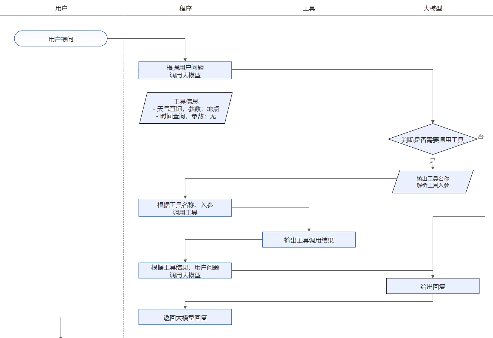

# AI 是如何调用 Function

## 什么是 Function Calling

功能调用（Function Calling）允许大型语言模型（LLM）在必要时调用一个或多个可用的工具，这些工具可以是外部API，或特定代码的执行等。功能调用是AI应用与模型交互中一个非常典型的范式，它可以辅助模型更好的回答用户问题。我们在给模型输入的过程中，附带上可用的函数列表（包含函数名、函数描述等），模型在收到问题和函数列表后，根据对问题的推理在必要的时候发起对函数的调用。

## Spring AI 做了什么

Spring AI 帮我们规范了函数定义、注册等过程，当模型决策在合适的时候去调用某个函数时，Spring AI 完成函数调用动作，最终将函数执行结果与原始问题再一并发送给模型，模型根据新的输入决策下一步动作。这其中涉及与大模型的多次交互过程，一次函数调用就是一次完成的交互过程。

## 交互流程图



## 出入参示例

以下是原生openai调用一次请求传递的参数，也可以替换地址和模型参数为通义千问。首次发起询问时通过`tools`参数传递的了`function`，定义了一个（或多个）`get_current_weather`方法，parameters里面有两个参数，string类型的location变量代表城市，string类型的unit代表气温类型，取值来自枚举范围。

```bash
curl https://api.openai.com/v1/chat/completions \
-H "Content-Type: application/json" \
-H "Authorization: Bearer $OPENAI_API_KEY" \
-d '{
  "model": "gpt-4o",
  "messages": [
    {
      "role": "user",
      "content": "What'\''s the weather like in Boston today?"
    }
  ],
  "tools": [
    {
      "type": "function",
      "function": {
        "name": "get_current_weather",
        "description": "Get the current weather in a given location",
        "parameters": {
          "type": "object",
          "properties": {
            "location": {
              "type": "string",
              "description": "The city and state, e.g. San Francisco, CA"
            },
            "unit": {
              "type": "string",
              "enum": ["celsius", "fahrenheit"]
            }
          },
          "required": ["location"]
        }
      }
    }
  ],
  "tool_choice": "auto"
}'
```

LLM根据提问内容和所有function的描述信息进行匹配，识别什么时候需要调用什么功能。通过返回值看到`content`是没有内容的，但是`tool_calls`告诉客户端，本次提问命中的函数是谁，参数是哪些？心想：你自己调用去吧。


```bash
{
	"choices": [{
		"message": {
			"content": "",
			"role": "assistant",
			"tool_calls": [{
				"function": {
					"name": "get_current_weather",
					"arguments": "{\"location\": \"Boston, MA\", \"unit\": \"fahrenheit\"}"
				},
				"index": 0,
				"id": "call_179df50e4367403cb850eb",
				"type": "function"
			}]
		},
		"finish_reason": "tool_calls",
		"index": 0,
		"logprobs": null
	}],
	"object": "chat.completion",
	"usage": {
		"prompt_tokens": 210,
		"completion_tokens": 27,
		"total_tokens": 237,
		"prompt_tokens_details": {
			"cached_tokens": 0
		}
	},
	"created": 1741069606,
	"system_fingerprint": null,
	"model": "qwen-plus",
	"id": "chatcmpl-3c1c0961-f38b-9b58-a899-61c532fd91b5"
}
```

## 测试

- 乘法运算
	- http://localhost:8080/ai/chat?userMessage=2乘3
- 除法运算
	- http://localhost:8080/ai/chat?userMessage=2除3
