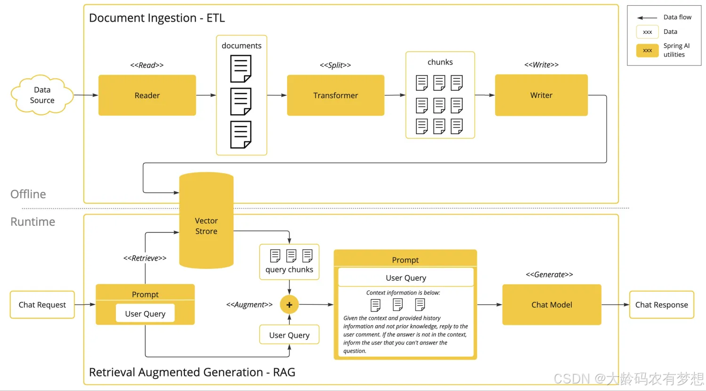

# 基于AI的大模型和检索增强生成（RAG, Retrieval-Augmented Generation）技术，利用海量的知识数据构建本地知识库

使用Spring AI、Milvus 和 Spring AI Alibaba 开源框架，搭建并验证一个基于AI大模型的本地知识库系统。将本地文档切片，使用Embedding向量化后保存到向量数据库并验证其在实际应用中的效果。

- 导入本地PDF
	- http://localhost:8080/milvus2/insertDocuments
- RAG检索测试
	- http://localhost:8080/milvus2/ragJsonText

## 执行原理

RAG 通过结合检索技术和生成模型的强大能力，使智能体能够实时从外部数据源获取信息，并在生成过程中增强其知识深度和推理能力。



RAG 是分为离线和运行时两部分。离线部分是将一些领域特有数据进行向量化的过程，将向量化的数据存入向量数据库。图中后半部分体现的运行时流程，Spring AI 框架在组装 prompt 时，会额外检索向量数据库，最终生成一个比用户原始问题具有更多辅助上下文的 prompt，然后将这个具备上下文的 prompt 给到模型，模型根据用户问题、上下文以及自己的推理生成响应。

Spring AI 提供了从离线数据加载、分析到向量化存储的抽象，也提供了运行时检索、prompt 增强的抽象。

通过端点调试，找到`com.alibaba.cloud.ai.advisor.RetrievalRerankAdvisor`类，其中有两个关键方法before和doRerank，官方代码如下:

```java
protected List<Document> doRerank(AdvisedRequest request, List<Document> documents) {
    if (CollectionUtils.isEmpty(documents)) {
       return documents;
    }

    var rerankRequest = new RerankRequest(request.userText(), documents);
    RerankResponse response = rerankModel.call(rerankRequest);
    logger.debug("reranked documents: {}", response);
    if (response == null || response.getResults() == null) {
       return documents;
    }

    return response.getResults()
       .stream()
       .filter(doc -> doc != null && doc.getScore() >= minScore)
       .sorted(Comparator.comparingDouble(DocumentWithScore::getScore).reversed())
       .map(DocumentWithScore::getOutput)
       .collect(toList());
}

private AdvisedRequest before(AdvisedRequest request) {

    var context = new HashMap<>(request.adviseContext());

    // 1. Advise the system text.
    String advisedUserText = request.userText() + System.lineSeparator() + this.userTextAdvise;

    var searchRequestToUse = SearchRequest.from(this.searchRequest)
       .query(request.userText())
       .filterExpression(doGetFilterExpression(context))
       .build();

    // 2. Search for similar documents in the vector store.
    logger.debug("searchRequestToUse: {}", searchRequestToUse);
    List<Document> documents = this.vectorStore.similaritySearch(searchRequestToUse);
    logger.debug("retrieved documents: {}", documents);

    // 3. Rerank documents for query
    documents = doRerank(request, documents);

    context.put(RETRIEVED_DOCUMENTS, documents);

    // 4. Create the context from the documents.
    String documentContext = documents.stream()
       .map(Document::getText)
       .collect(Collectors.joining(System.lineSeparator()));

    // 5. Advise the user parameters.
    Map<String, Object> advisedUserParams = new HashMap<>(request.userParams());
    advisedUserParams.put("question_answer_context", documentContext);

    return AdvisedRequest.from(request)
       .userText(advisedUserText)
       .userParams(advisedUserParams)
       .adviseContext(context)
       .build();
}
```

这段代码定义了一个名为 `before` 的方法，该方法接收一个 `AdvisedRequest` 对象作为输入，并返回一个新的 `AdvisedRequest` 对象。该方法的主要目的是对用户输入的文本进行预处理、检索相关文档、重排序文档，并生成上下文信息，以便后续处理。以下是详细的步骤和功能说明：

### 1. 方法签名

```java

private AdvisedRequest before(AdvisedRequest request) {

```

- **`before` 方法**：这是一个私有方法，接收一个 `AdvisedRequest` 对象作为参数，并返回一个新的 `AdvisedRequest` 对象。

### 2. 初始化上下文

```java

var context = new HashMap<>(request.adviseContext());

```

- 创建一个新的 `HashMap` 对象 `context`，并从输入的 `request` 中复制现有的建议上下文（`adviseContext`）。

### 3. 构建建议的用户文本

```java

String advisedUserText = request.userText() + System.lineSeparator() + this.userTextAdvise;

```

- 将输入请求中的用户文本（`userText`）与预先定义的用户文本建议（`userTextAdvise`）拼接在一起，并使用系统换行符（`System.lineSeparator()`）分隔它们，形成新的建议用户文本（`advisedUserText`）。

### 4. 构建搜索请求

```java

var searchRequestToUse = SearchRequest.from(this.searchRequest)

    .query(request.userText())

    .filterExpression(doGetFilterExpression(context))

    .build();

```

- 使用 `SearchRequest.from(this.searchRequest)` 方法从现有的搜索请求模板创建一个新的搜索请求对象。

- 设置查询文本为 `request.userText()`。

- 调用 `doGetFilterExpression(context)` 方法生成过滤表达式，并将其应用到搜索请求中。

- 最终构建并返回新的搜索请求对象 `searchRequestToUse`。

### 5. 执行相似度搜索

```java

logger.debug("searchRequestToUse: {}", searchRequestToUse);

List<Document> documents = this.vectorStore.similaritySearch(searchRequestToUse);

logger.debug("retrieved documents: {}", documents);

```

- 记录调试信息，输出构建好的 `searchRequestToUse`。

- 使用向量存储（`vectorStore`）执行相似度搜索，获取与查询文本最相关的文档列表（`documents`）。

- 记录调试信息，输出检索到的文档列表。

### 6. 文档重排序

```java

documents = doRerank(request, documents);

```

- 调用 `doRerank` 方法对检索到的文档进行重排序，以优化其相关性顺序，并更新文档列表 `documents`。

### 7. 更新上下文

```java

context.put(RETRIEVED_DOCUMENTS, documents);

```

- 将重排序后的文档列表添加到上下文 `context` 中，键名为 `RETRIEVED_DOCUMENTS`。

### 8. 生成文档上下文

```java

String documentContext = documents.stream()

    .map(Document::getText)

    .collect(Collectors.joining(System.lineSeparator()));

```

- 将文档列表中的每个文档的文本内容提取出来，并使用系统换行符连接成一个字符串 `documentContext`。

### 9. 构建建议的用户参数

```java

Map<String, Object> advisedUserParams = new HashMap<>(request.userParams());

advisedUserParams.put("question_answer_context", documentContext);

```

- 创建一个新的 `HashMap` 对象 `advisedUserParams`，并从输入请求中复制现有的用户参数（`userParams`）。

- 将生成的文档上下文（`documentContext`）作为键值对 `"question_answer_context"` 添加到用户参数中。

### 10. 返回新的 `AdvisedRequest` 对象

```java

return AdvisedRequest.from(request)

    .userText(advisedUserText)

    .userParams(advisedUserParams)

    .adviseContext(context)

    .build();

```

- 使用 `AdvisedRequest.from(request)` 方法从输入请求创建一个新的 `AdvisedRequest.Builder`。

- 设置新的用户文本（`advisedUserText`）、用户参数（`advisedUserParams`）和建议上下文（`context`）。

- 构建并返回新的 `AdvisedRequest` 对象。

## 总结

RetrievalRerankAdvisor.before() 方法主要完成以下任务：

1. **初始化上下文**：从输入请求中复制现有的建议上下文。

2. **构建建议的用户文本**：将用户输入的文本与预先定义的建议文本拼接在一起。

3. **构建搜索请求**：根据用户输入的文本和上下文生成搜索请求。

4. **执行相似度搜索**：在向量存储中查找与查询文本最相关的文档。

5. **文档重排序**：对检索到的文档进行重排序，优化其相关性顺序。

6. **更新上下文**：将重排序后的文档列表添加到上下文中。

7. **生成文档上下文**：将文档列表中的文本内容拼接成一个字符串。

8. **构建建议的用户参数**：将生成的文档上下文作为用户参数的一部分。

9. **返回新的请求对象**：构建并返回包含所有更新信息的新 `AdvisedRequest` 对象。